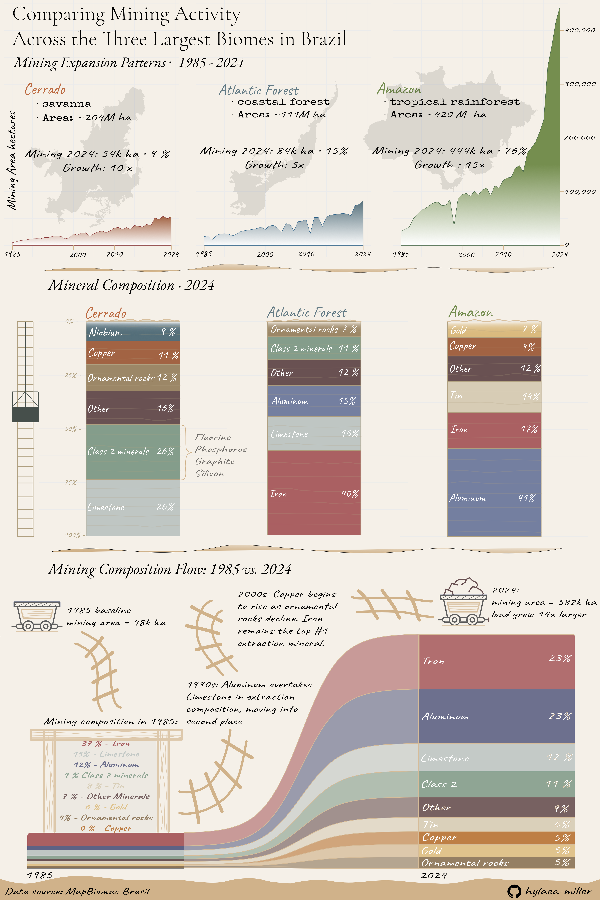

Brazil holds vast mineral reserves. The Cerrado, Atlantic Forest, and Amazon, three of the country’s most biodiverse biomes, together cover about 85% of its territory, and beneath them lie minerals essential to global development. Over the past four decades, mining has expanded, leaving an increasing footprint on these ecosystems. I wanted to understand not only how much land has been converted to mining, but also where, which minerals, and how their composition has changed over time. My questions were:

-   How has mined area grown across each biome since 1985?

-   What are the differences in mineral composition in each biome’s extraction in 2024?

-   How has the overall mineral composition changed between 1985 and 2024?

The data comes from MapBiomas Brasil[^1], which provides annual land‑use and land‑cover maps for Brazil from 1985 to 2024 at 30 m resolution.

[^1]: MapBiomas Brasil. (2026). Retrieved March 9, 2026, from Mapbiomas.org website: https://brasil.mapbiomas.org/

    ‌

{fig-alt="Infographic showing mining expansion across Brazil's Cerrado, Atlantic Forest, and Amazon biomes from 1985 to 2024. Includes area charts per biome, stacked bar charts of mineral composition in 2024, and an alluvial chart comparing mineral composition between 1985 and 2024. The Amazon shows the sharpest growth, and Iron and Aluminum together account for 46% of all mined area by 2024"}

## Design Decisions

**Graphic forms**

The infographic is organized into three sections, each answering one of my questions. Section one uses area charts, one per biome, to show mining expansion over time. The biome shape sits as a watermark behind each chart, grounding the reader geographically without adding a separate map panel. Section two uses stacked bar charts oriented as geological strata, one per biome, showing mineral composition in 2024. Section three uses an alluvial chart comparing mineral composition between 1985 and 2024.

**Text and annotations**

Rather than relying on traditional axis titles and chart legends, most context is delivered through direct annotations. Each biome panel in section one includes the biome type, total area, 2024 mined area, and growth factor. Section two labels each mineral segment inline, removing the need for a separate legend. Section three uses narrative text anchored to a mining cart at 1985 and at 2024.

**Theme**

The overall aesthetic draws from a field notebook, with cream background, minimal gridlines, hand-drawn-style rail tracks as decorative elements in section three. I assembled the final layout in Affinity Designer, using R-generated plots as the base for all data elements.

**Colors**

All colors were chosen from a warm, earthy palette inspired by soil and mineral tones. This reinforces the geological theme and keeps the infographic visually cohesive across all three sections. The same mineral colors are used consistently in sections two and three, so the reader can track each mineral across plots without re-learning a legend.

**Typography**

I used *Cormorant Garamond* and *EB Garamond* for titles and subtitles, and *Caveat* for annotations and labels. Both fonts fit the field-notebook aesthetic, *Garamond* brings an scientific feel while *Caveat* adds a hand-drawn style to the narrative elements. Text weight and size hierarchy guide the reader from title → section heading → annotation → data label.

**General design and primary message**

Visual hierarchy was established through size, and placement. The three sections are clearly separated and Biomes are consistently ordered left to right as Cerrado, Atlantic Forest, and Amazon throughout the sections.

The primary message, that mining has expanded across all three biomes, with the Amazon experiencing the sharpest acceleration, is established in the first section and then detailed throughout the rest of the infographic through the composition. The Amazon’s area chart is placed last and scaled to the same axis as the others, making its exponential growth visible by comparison.

**Contextualizing the data**

The growth multipliers (10×, 5×, 15×) in section one were important to include alongside absolute hectares, because the Amazon's size makes its raw number dominate visually. Showing both absolute area and growth rate gives a fairer comparison across biomes. The biome total area is also listed, allowing readers to judge the mining footprint relative to biome size.

**Accessibility**

The color palette is not perfectly colorblind‑friendly, but no information is conveyed by color alone, every mineral segment is directly labeled with its name and percentage. Alt text is included in the published version of this post for the infographic.

**Applying a DEI lens**

The biomes represented in this infographic are home to Indigenous communities, traditional populations, and some of the most biodiverse ecosystems. Mining expansion in the Amazon in particular has well-documented impacts on Indigenous territories. While this infographic focuses on area and composition data rather than social impacts, framing the growth figures as a footprint rather than simply output is a deliberate choice to keep those stakes visible.

**Explore the code!**

*Expand the chunk below to explore the full R code used to generate all plots.*

```{r}
#| output: false
# Load packages and function
library(tidyverse)
library(here)
library(tmap)
library(showtext)
library(scales)
library(ggalluvial)
library(geobr)
library(sf)


source(here("R","clean.R"))


# Read data
mining_amazon <- read.csv(here("data", "mining_amazon.csv"))
mining_cerrado <- read.csv(here("data", "mining_cerrado.csv"))
mining_forest <- read.csv(here("data", "mining_mata_atlantica.csv"))

# Apply function to all biome datasets
mining_amazon <- clean_df(mining_amazon) %>% mutate(Biome = "Amazon")
mining_cerrado <- clean_df(mining_cerrado) %>% mutate(Biome = "Cerrado")
mining_forest <- clean_df(mining_forest) %>% mutate(Biome = "Atlantic Forest")


# Combine the rows from all dataframes and create column that sum all the mining area
total_mining <- bind_rows(
  mining_amazon,
  mining_cerrado,
  mining_forest
) %>% 
  mutate(Total = rowSums(across(-c(Ano, Biome)), na.rm = TRUE))

# Transform to long format 
mining_long <- total_mining %>%
  select(-ends_with(".1")) %>%  # Remove all .1 columns
  pivot_longer(
    cols = -c(Ano, Biome, Total), 
    names_to = "Mineral", 
    values_to = "Area") %>%
  mutate(
    Mineral = case_match(
      Mineral,
      "Ouro" ~ "Gold",
      "Ferro" ~ "Iron",
      "Alumínio" ~ "Aluminum",
      "Estanho" ~ "Tin",
      "Carvão.mineral" ~ "Coal",
      "Cobre" ~ "Copper",
      "Calcário" ~ "Limestone",
      "Minerais.de.Classe.2" ~ "Class 2",
      "Rochas.ornamentais" ~ "Ornamental rocks",
      "Nióbio" ~ "Niobium",
      "Manganês" ~ "Manganese",
      .default = Mineral
    )
  ) %>% drop_na(Area)

# Filter data to 2024 and calculate percentage
data_2024 <- mining_long %>%
  filter(Ano == 2024) %>%
  group_by(Biome, Mineral) %>%
  summarise(Area = sum(Area, na.rm = TRUE), .groups = "drop") %>%
  group_by(Biome) %>%
  mutate(
    Percentage = Area / sum(Area) * 100,
    Mineral = if_else(
      dense_rank(desc(Area)) <= 5,
      Mineral,
      "Other"
    )
  ) %>%
  group_by(Biome, Mineral) %>%
  summarise(Percentage = sum(Percentage), .groups = "drop") %>%
  mutate(
    Biome = factor(Biome, levels = c("Amazon", "Atlantic Forest", "Cerrado"))
  )

# Prepare data for 1985 and 2024 comparison
sankey_data <- mining_long %>%
  filter(Ano %in% c(1985, 2024), !is.na(Area), Area > 0) %>%
  group_by(Ano, Mineral) %>%
  summarise(Area = sum(Area, na.rm = TRUE), .groups = "drop") %>%
  group_by(Ano) %>%
  mutate(
    Percentage = Area / sum(Area) * 100,
    Mineral = if_else(
      dense_rank(desc(Area)) <= 8,
      Mineral,
      "Other"
    )
  ) %>%
  group_by(Ano, Mineral) %>%
  summarise(
    Area = sum(Area, na.rm = TRUE),
    Percentage = sum(Percentage),
    .groups = "drop"
  )

# Define biome color palette
biome_colors <- c(
  "Amazon" = "#758E4F",
  "Atlantic Forest" = "#33658A",
  "Cerrado" = "#B37761"
)


# Define mineral color palette for pit mining
mineral_colors <- c(
  "Gold" = "#DABA7E",
  "Iron" = "#AB6062",
  "Aluminum" = "#5E6284",
  "Tin" = "#D8CCB5",
  "Coal" = "#2F4F4F",
  "Copper" = "#B87333",
  "Limestone" = "#BFC6C3",
  "Class 2" = "#859D8B",
  "Ornamental rocks" = "#8B7355",
  "Niobium" = "#556F7A",
  "Other" = "#695152"
)


# Plot 1: Mining by year and biome 
total_mining <- total_mining %>% 
  mutate(Biome = factor(Biome, levels = c("Cerrado", "Atlantic Forest", "Amazon")))

plot1 <- ggplot(total_mining, aes(x = Ano, y = Total, fill = Biome)) +
  geom_area() +
  facet_wrap(~Biome) +
  scale_fill_manual(values = biome_colors) +
  scale_y_continuous(labels = scales::comma_format()) +
  theme_minimal() +
  labs(
    x = "Year",
    y = "Mining Area (hectares)",
    title = "Mining Expansion Patterns Across Brazil's Three Largest Biomes (1985-2024)",
    subtitle = "Amazon shows steep growth post-2015, while Atlantic Forest and Cerrado grew more steadily"
  ) +
  theme(legend.position = "none",
        plot.title = element_text(
                                          face = "bold",
                                          size = rel(1.5),
                                          lineheight = 1.3,
                                  color = "#2C3E50"
                                          ),
        plot.subtitle = element_text(
                                     size = rel(1.2),
                                     color="#7F8C8D",
                                     ),
      plot.caption = element_text(
      size = rel(1.3),
      color = "#7F8C8D",
      hjust = 0,
      face = "italic",
      margin = margin(t = 10)
    ),
       axis.text = element_text(size = rel(1.3)),
    axis.title.x = element_text(
                                size = rel(1.3), 
                                margin = margin(t = 15)),
    axis.title.y = element_text(
                                size = rel(1.3), 
                                margin = margin(r = 10))
    )


# Create a function to generate the mining‑composition plot for a selected biome
plot_biome <- function(biome_name) {
  data_2024 %>% 
    filter(Biome == biome_name) %>% 
    mutate(Mineral = fct_reorder(Mineral, Percentage)) %>% 
    ggplot(aes(x = "", y = Percentage, fill = Mineral)) +
    geom_col(width = 0.6) +
    scale_fill_manual(values = mineral_colors) +
    scale_y_continuous(labels = percent_format(scale = 1), expand = c(0, 0)) +
    labs(title = biome_name, x = NULL, y = "Percentage of Mining Area") +
    theme_minimal() +
    theme(
      legend.position = "none",
      plot.title = element_text( face = "bold", size = rel(1.7), color = "#2C3E50"),
      axis.text = element_text(size = rel(1.5), color = "#34495E"),
      axis.title.x = element_text(size = rel(1.5), face = "bold", color = "#34495E")
    )
}

plot2_cerrado <- plot_biome("Cerrado")
plot2_atlantic <- plot_biome("Atlantic Forest")
plot2_amazon <- plot_biome("Amazon")


# Adjust data to the sankey plot
sankey_data <- sankey_data %>%
  complete(
    Ano,
    Mineral,
    fill = list(Area = 0)
  ) 
  
# Order minerals by 2024 (descending)
mineral_order_2024 <- sankey_data %>%
  filter(Ano == 2024) %>%
  arrange(desc(Area)) %>%
  pull(Mineral)

# Order minerals by 1985 (descending)
mineral_order_1985 <- sankey_data %>%
  filter(Ano == 1985) %>%
  arrange(desc(Area)) %>%
  pull(Mineral)

sankey_data <- sankey_data %>%
  mutate(
    Mineral = factor(Mineral, levels = mineral_order_1985)
  )

# Plot Sankey diagram
plot3 <- ggplot(
  sankey_data,
  aes(
    x = factor(Ano),
    y = Area,
    stratum  = Mineral,
    alluvium = Mineral
  )) +
  geom_flow(
    aes(fill = Mineral),
    alpha = 0.6,
    curve_type = "sigmoid",
    width = 0.4 ) +
  geom_stratum(
    aes(fill = Mineral),
    alpha = 0.9,
    width = 0.4
  ) +
  geom_text(
 stat = "stratum",
  aes(
    label = if_else(
      as.integer(as.character(Ano)) == 2024,
      paste0(Mineral, "\n", round(Percentage, 1), "%"),
      ""
    )),
  color = "white",
  size = 3.5,
  fontface = "bold"
) +
  scale_fill_manual(values = mineral_colors, drop = FALSE) +
  labs(title = "Changes in Brazil's Mining Composition, 1985–2024") +
  theme_void() +
  theme(
  axis.text.x = element_text(),
  legend.position = "none",
  plot.title = element_text(
      face = "bold",
      size = 18,
      hjust = 0.5,
      color = "#2C3E50",
      margin = margin(b = 5, t = 20) ),
  plot.caption = element_text(
      size = rel(1.5),
      color = "#7F8C8D",
      hjust = 0,
      face = "italic",
      margin = margin(t = 10)))


# Read Brazil biomes data
biomes <- read_biomes(year = 2019)

# Plot the biomes
biomes <- plot(st_geometry(biomes))

```
